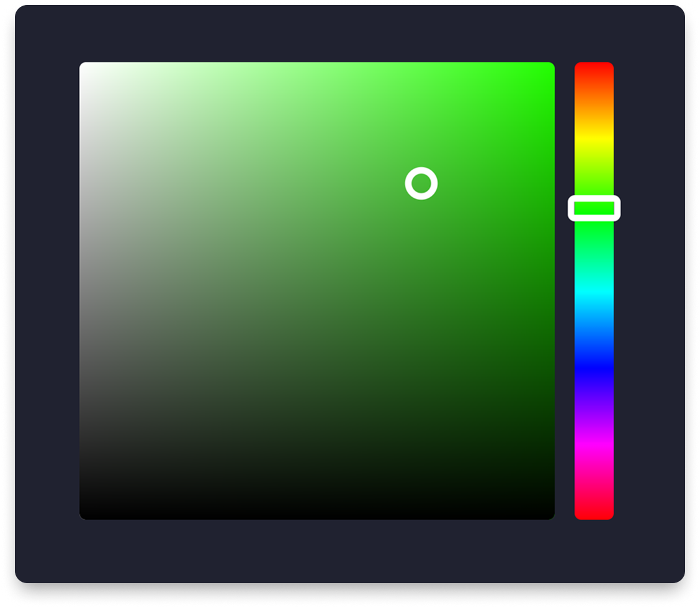

# 🎨 Kolor Picker

A customizable color picker component for Compose Multiplatform with hue slider and 2D color selection.


<div align="center">

</div>

## Supported platforms

| Platform | Support |
|----------|---------|
| Android  | ✅       |
| iOS      | ✅       |
| Desktop  | ✅       |
| Web      | ✅       |


## Installation


```kotlin
repositories {
    mavenCentral()
}

dependencies {
    implementation("com.kborowy:color-picker:<latest-version>")
}
```

## 🧑‍💻 Usage

```kotlin

var selectedColor by remember { mutableStateOf(Color(red = 120, green = 194, blue = 87)) }
KolorPicker(
    onColorSelected = { selectedColor = it },
    modifier = Modifier.width(250.dp).height(200.dp),
)

```

## 🛠️ API Parameters

### `KolorPicker` Composable
| Parameter           | Type                   | Default      | Description                                       |
|---------------------|------------------------|--------------|---------------------------------------------------|
| `onColorSelected`   | `(Color) -> Unit`      | **Required** | Callback invoked when a new color is selected     |
| `modifier`          | `Modifier`             | `Modifier`   | Layout modifiers                                  |
| `initialColor`      | `Color`                | `Color.Red`  | The initially selected color when picker loads    |
| `hueSliderConfig`   | `HueSliderThumbConfig` | `Default`    | Configuration for the hue slider thumb appearance |
| `pickerThumbConfig` | `PickerThumbConfig`    | `Default`    | Configuration for the color selection thumb       |


### `HueSliderThumbConfig`
| Parameter      | Type    | Default       | Description                         |
|----------------|---------|---------------|-------------------------------------|
| `height`       | `Dp`    | `12.dp`       | Vertical height of the slider thumb |
| `color`        | `Color` | `Color.White` | Fill color of the thumb             |
| `borderSize`   | `Dp`    | `4.dp`        | Width of the border stroke          |
| `borderRadius` | `Float` | `6f`          | Corner radius for rounded corners   |


### `PickerThumbConfig`
| Parameter | Type    | Default       | Description                     |
|-----------|---------|---------------|---------------------------------|
| `size`    | `Dp`    | `8.dp`        | Diameter of the selection thumb |
| `color`   | `Color` | `Color.White` | Color of the thumb indicator    |


# License

    Copyright 2025 Krzysztof Borowy
    
    Licensed under the Apache License, Version 2.0 (the "License");
    you may not use this file except in compliance with the License.
    You may obtain a copy of the License at
    
       http://www.apache.org/licenses/LICENSE-2.0
    
    Unless required by applicable law or agreed to in writing, software
    distributed under the License is distributed on an "AS IS" BASIS,
    WITHOUT WARRANTIES OR CONDITIONS OF ANY KIND, either express or implied.
    See the License for the specific language governing permissions and
    limitations under the License.
